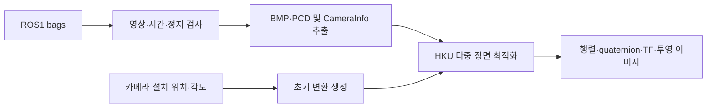

# ZED2–MID-360 Calibration

ROS 1 Noetic에서 여러 정지 장면의 bag을 이용해 **ZED2 왼쪽 카메라와 Livox MID-360의 외부 파라미터**를 추정하는 패키지입니다.

`hku-mars/livox_camera_calib`의 다중 장면 최적화를 사용하며, bag 추출·설정 생성·실행·결과 내보내기를 자동화합니다. 카메라 위치와 각도는 사용자가 설정하는 초기값입니다.

**검증 상태:** 합성 bag 기반 Python 테스트 13개 통과. 실제 장비 정확도와 ROS/C++ 통합 실행은 아직 검증되지 않았습니다. GitHub Actions도 합성 테스트를 수행합니다.

## 처리 과정



## 필요한 입력

| 입력 | 조건 |
|---|---|
| Bag | ROS1 `.bag` 한 개 이상. 각 bag 중앙에 정지 구간 필요 |
| 영상 | ZED **왼쪽 rectified** Image 또는 CompressedImage |
| 내부 파라미터 | 같은 해상도·프레임의 CameraInfo |
| 라이다 | PointCloud2 또는 Livox CustomMsg |
| 설치 위치 | 라이다 기준 왼쪽 렌즈 중심의 앞·왼쪽·아래 거리[m] |
| 설치 각도 | 아래쪽 기울기, yaw, roll[°] |

## 빠른 시작

실제 최적화 환경은 **Ubuntu 20.04 / ROS1 Noetic / Python 3.8**입니다.
먼저 [HKU livox_camera_calib](https://github.com/hku-mars/livox_camera_calib)을 빌드하고 해당 워크스페이스를 source해야 합니다.

이 저장소를 `~/ws_calibration/src/zed_mid360_calibration`에 놓은 뒤 실행합니다.

```bash
source /opt/ros/noetic/setup.bash
# HKU가 다른 워크스페이스에 있다면 그 devel/setup.bash도 source

sudo apt update
sudo apt install -y python3-numpy python3-scipy python3-opencv python3-yaml \
  python3-setuptools ros-noetic-rosbag ros-noetic-roslaunch \
  ros-noetic-sensor-msgs ros-noetic-tf2-ros xvfb xauth

cd ~/ws_calibration
catkin_make -DCMAKE_BUILD_TYPE=Release -DPYTHON_EXECUTABLE=/usr/bin/python3
source devel/setup.bash

cp "$(rospack find zed_mid360_calibration)/config/calibration.yaml" ~/zed_mid360.yaml
```

`~/zed_mid360.yaml`에서 세 거리값을 **직접 측정한 값**으로 수정합니다. `null` 상태에서는 실행되지 않습니다.

```yaml
camera_mount:
  forward_m: null
  left_m: null
  down_m: null
  pitch_down_deg: 10.0
  yaw_left_deg: 0.0
  roll_deg: 0.0
```

토픽을 확인하고 캘리브레이션을 실행합니다.

```bash
rosrun zed_mid360_calibration calibrate_bags.py ~/bags --inspect

rosrun zed_mid360_calibration calibrate_bags.py ~/bags \
  --config ~/zed_mid360.yaml \
  --output ~/calibration_results/run_01
```

기본 토픽은 `/livox/lidar`, `/zed2/zed_node/left/image_rect_color`,
`/zed2/zed_node/left/camera_info`입니다. 다르면 설정 파일에서 변경하세요.
`--output`은 새 폴더여야 합니다. `--prepare-only`를 추가하면 최적화 없이 추출만 실행합니다.

## 결과

| 파일 | 내용 |
|---|---|
| `extrinsics.yaml` | 양방향 변환, quaternion, 프레임, 검사 상태 |
| `T_camera_lidar.txt` | `p_camera = T_camera_lidar @ p_lidar` |
| `T_lidar_camera.txt` | 역변환 |
| `static_tf.launch` | 라이다 → 왼쪽 optical 프레임의 ROS1 TF 설정 |
| `overlays/` | 초기/최종 파라미터의 영상 투영 |
| `report.json` | 대응점·영상 겹침·초기값 대비 변화 검사 |
| `backend.log` | 최적화 로그 |

카메라는 optical 좌표계(오른쪽 X, 아래 Y, 전방 Z), 라이다는 FLU(전방 X, 왼쪽 Y, 위 Z)입니다.
거리 단위는 m, quaternion 순서는 **qx, qy, qz, qw**입니다.

## 사용 범위

- 각 bag 중앙의 최대 5초를 사용합니다. 움직임이 감지되면 다른 구간을 탐색하지 않고 중단합니다.
- CameraInfo에서 rectified 투영행렬을 추출합니다. 내부 파라미터 자체를 재보정하지는 않습니다.
- 정지 장면 전용이며 움직임 보정(SLAM/deskew), 시간 오프셋 자동 추정은 하지 않습니다.
- 최적화는 초기값과 장면의 입체 경계에 의존합니다. 임의 장면에서의 수렴을 보장하지 않습니다.
- `estimated_unvalidated`는 기본 검사만 통과한 추정값입니다. 투영 이미지를 확인하고 독립 장면으로 검증하세요.
- HKU 설치·빌드와 실제 센서 데이터는 별도로 필요합니다.

## 문서와 개발

- [상세 설치·설정·좌표계 설명](docs/usage_ko.md)
- [구조와 실행 흐름](docs/architecture.md)
- [문제 해결](docs/troubleshooting.md)
- [개발 및 테스트](CONTRIBUTING.md)
- [GitHub 업로드 안내](docs/publishing.md)
- [변경 기록](CHANGELOG.md)

Python 3.10+ 개발 환경에서 합성 테스트를 실행할 수 있습니다.

```bash
python -m pip install -r requirements-dev.txt
python -m pytest -q
```

Noetic 런타임의 ROS/OpenCV 의존성은 apt로 설치합니다. 개발용 pip 의존성과 분리하세요.

## 라이선스와 출처

이 저장소의 코드와 문서는 [MIT License](LICENSE)를 따릅니다.
최적화 알고리즘은 별도 의존성인 [HKU livox_camera_calib](https://github.com/hku-mars/livox_camera_calib)에서 제공합니다.
상위 프로젝트 소스나 학습 데이터는 이 저장소에 포함하지 않습니다.

